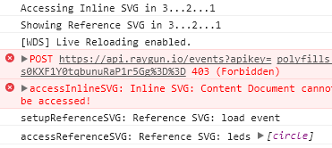

# Mixer Sample SVG

This is a sample project to show a custom Mixer control attempting to access the SVG DOM.

## Getting Started

* Open this folder with the `Control Development Kit`

## New Project References

* [Getting Started with Preact](https://dev.mixer.com/guides/mixplay/customcontrols/gettingstartedwithpreact)

* [Getting Started with HTML](https://dev.mixer.com/guides/mixplay/customcontrols/gettingstartedwithhtml)

* [Custom Control Documentation](https://dev.mixer.com/guides/mixplay/customcontrols/introduction)

* [CSDK Standard Library Reference](https://mixer.github.io/cdk-std/)

* [GameClient SDKs](https://dev.mixer.com/guides/mixplay/introduction#choosing-an-sdk-environment)

## Reproducible Errors

* The inline SVG is just a test and doesn't have access to the `content document` in both cases.

### Output From CDK

* The referenced SVG has access to the `content document`.

### Output From Mixer Site

* The referenced SVG does not have access to the `content document`.

